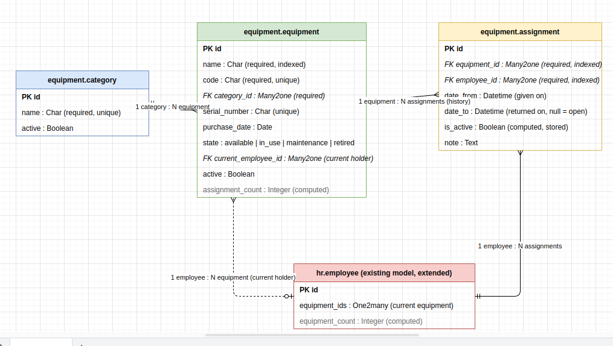

# Equipment Management (Odoo 18)

An Odoo module to manage company equipment (laptops, phones, tools, accessories), give it to employees, and keep the full history.

## 1. Business need

Before: tracking was done in spreadsheets and emails. Problems:

- nobody knows who has which equipment
- no assignment history
- equipment looks unavailable when it is not
- managers have no overview
- it gets slow as data grows

This module answers each problem inside Odoo:

| Problem | Solution |
|---|---|
| Who has what? | Each equipment shows its status and current employee |
| No history | Every give / return is stored as an assignment record |
| Wrong availability | Status is updated automatically on give and return |
| No overview | Kanban, filters, group-by, graph and pivot |
| Slow with big data | Indexes, SQL aggregation, no history scan for current state |

## 2. Data model

## 3. Features

- Register equipment with unique code and serial number.
- Give equipment to an employee (only if it is available). The status changes to *In Use*.
- Return equipment. The return date is saved and the status goes back to *Available*.
- Send to maintenance, back to available, retire (manager only).
- An equipment with history cannot be deleted. It must be archived.
- Equipment form: status bar, "currently assigned to" banner, assignment history tab, assignment counter.
- Employee form: equipment counter, history, give equipment, equipment tab.

## 4. Menus

- **Employees** (managers)
- **Operations**: Current Assignments, Assignment History
- **Inventory**: All Equipment, Available, In Use, Maintenance
- **Analysis** (managers): Equipment Status (graph and pivot), Assignment Activity (graph)
- **Configuration** (managers): Categories

## 5. Search, filters and views

- Search by name, code or serial number in one box.
- Filters: Available, In Use, Maintenance, Retired, Archived. For assignments: In Progress, Returned, Given Date.
- Group by: Category, Status, Employee, Equipment, Given Month.
- Search panel with counters (status and category).
- Views: kanban (colored by status), list with status badges, form, graph, pivot.

## 6. Access rights

| Group | Can do |
|---|---|
| **Equipment: User** | See equipment, give and return equipment |
| **Equipment: Manager** | Everything: create, edit, delete, retire, categories, analysis |

Notes:

- Manager also implies **HR Officer**, because the standard employee form reads fields reserved for that group.
- Odoo administrators are automatically Equipment managers.
- Two demo users exist: `user` and `manager` (password `odoo`).

## 7. Assumptions

- One equipment has one holder at a time.
- One employee can hold several equipment items.
- Equipment with history is archived, never deleted.
- *Retired* is final.
- Single company.
- Dates are date and time, to keep the exact moment of give and return.

## 8. Performance and scalability
The module is designed to work well even with many equipment items and a large history.
- We store the current status directly on the equipment.
- We add indexes to make searches faster.
- We use _read_group to calculate counters without loading all records.
- is_active is stored to make filtering faster.
## 9. How I tested with large data

I wrote a generator script (`scripts/gen_data.py`, kept outside the module) that creates:

- 2,000 employees
- 50,000 equipment items
- several hundred thousand assignments (history plus current)

Run it with `odoo shell`. Then I checked the data with SQL, measured the slow queries with `EXPLAIN (ANALYZE, BUFFERS)`, and timed the main screens in the browser.

